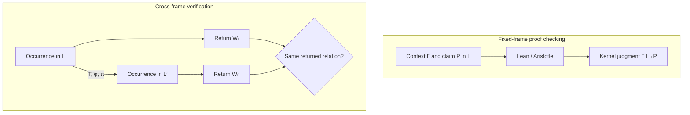

# Classical Mathematical AI vs Translational Closure

## The complementary verification questions

**PROVED / EXISTING VERIFICATION:** Lean and Aristotle establish a local derivability judgment in a
selected formal language:

`Γ ⊢_L P`.

**CONJECTURED / EXPERIMENTAL EXTENSION:** translational axiometry studies a changed formal frame:

`(L, Γ, P) --(T, φ, π)--> (L′, Γ′, P′)`

and asks whether the independently selected return square commutes.

The second layer still requires the first: Lean checks each formalization and the claimed bridge.

| Layer | Classical mathematical AI | Translational / closure verification |
|---|---|---|
| Trusted judgment | proof checked in a selected kernel and context | local proofs plus a checked cross-frame return/coherence relation |
| Representation | fixed, or normalized back into a privileged formalism | independently generated formalisms connected after generation |
| Capability growth | stronger search, synthesis, and proof construction | may also alter definitions, axiomatization, geometry, ontology, or route |
| Equality | definitional/propositional equality inside the formal system | closure equality may identify distinct occurrences with one return |
| History | derivation matters operationally | path independence is a hypothesis/theorem to test, not assume for real agents |
| Failure | rejected proof or counterexample | rejected proof, broken return, explicit counterexample, or OPEN bridge |

## What the current theorem says

**PROVED:** inside `TransFrame`, coherent translations preserve and reflect closure equality, and
admissible verdicts are exactly return measurements.

**NOT ESTABLISHED:** arbitrary learning, self-modification, or re-axiomatization is a
return-preserving `Restructuring`. Calling `capability_is_gauge` does not remove that premise.

## What the experiment changes

The D4 experiment fixes `W`, independently generates both mathematical presentations, freezes
them, and discovers a bridge only afterward. Adversarial and partial maps are scored by the same
gate. This tests whether closure constrains transformations independently rather than defining
“admitted” to mean “already return-preserving.”
